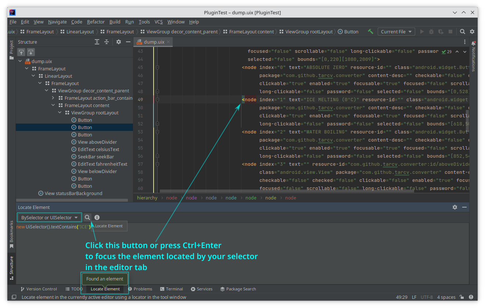
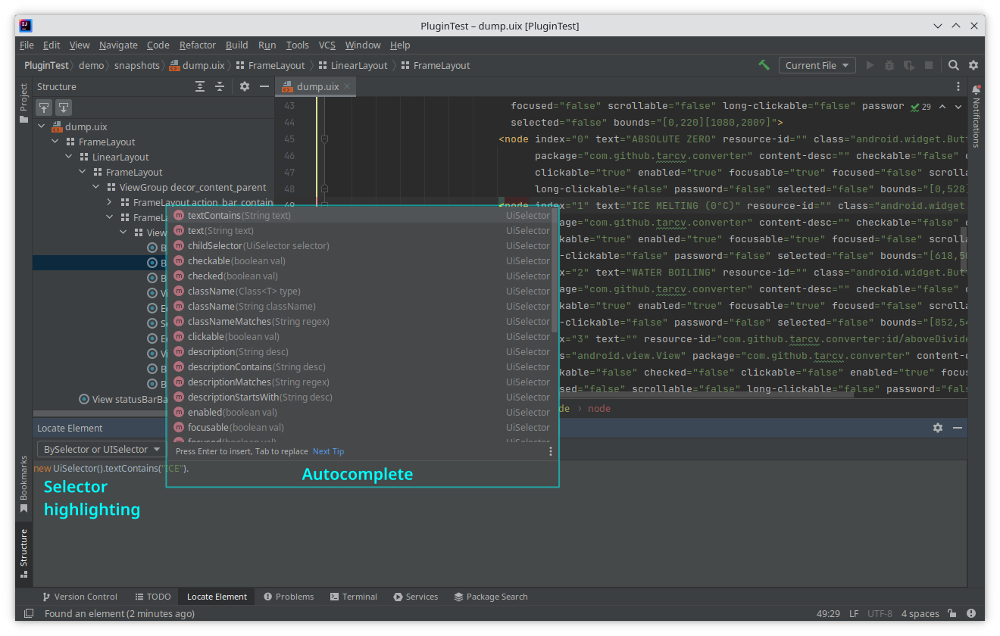
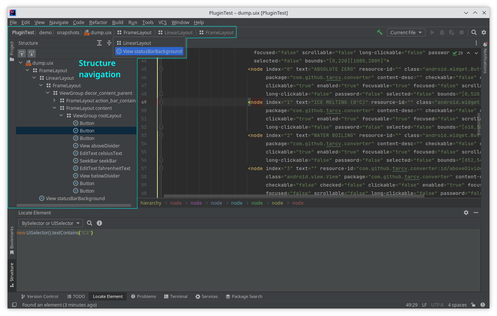
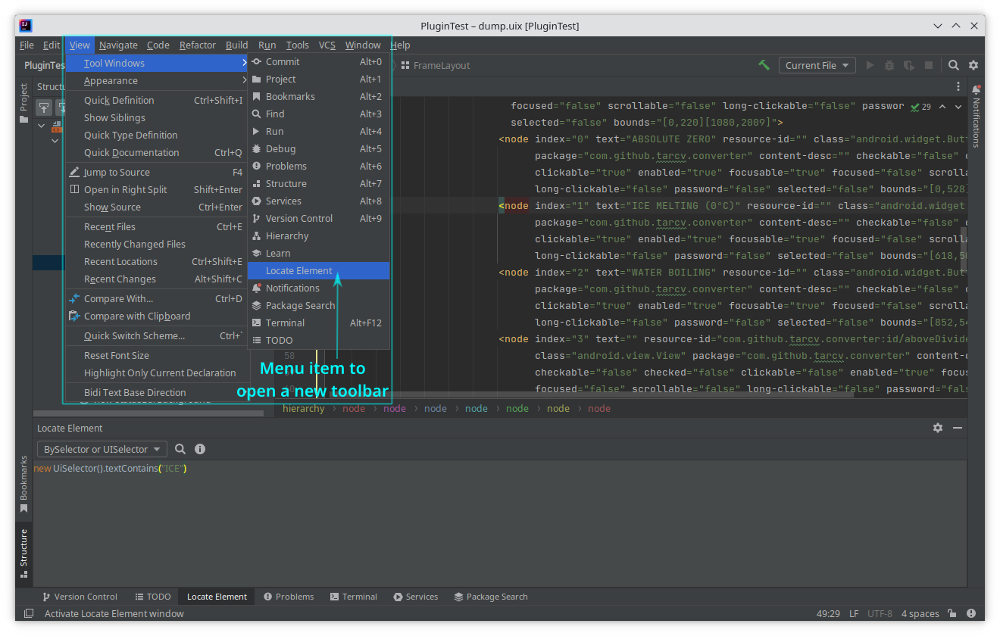

# UI Surveyor plugin for IDEA

## Description

UI Surveyor plugin provides tools helping with mobile application automation.
They provide the following features:
* **_Evaluating_ element selectors against an XML UI snapshots**  

* **Syntax highlighting and autocomplete for element selectors**  

* **Improved structure navigation for XML UI snapshots**  

If for some reason `Locate Element` tool window is not enabled, you can open it from the View menu:  

At the moment
<!-- Plugin description -->
UI Surveyor plugin provides tools helping work with Android UI Snapshot in XML format and UIAutomator selectors.

Those tools are:
* `Locate Element` tool window for **evaluating** element selectors against a currently open XML UI snapshots
* Basic syntax highlighting and autocomplete for UIAutomator selectors (as Java code)
* Improved structure navigation for UI snapshots

All trademarks are the property of their respective owners. All company, product and service names
used in this plugin description are for identification purposes only. Use of these names or brands does not imply endorsement.
<!-- Plugin description end -->

## Installation

- Using IDE built-in plugin system:
  
  <kbd>Settings/Preferences</kbd> > <kbd>Plugins</kbd> > <kbd>Marketplace</kbd> > <kbd>Search for "surveyor-idea"</kbd> >
  <kbd>Install Plugin</kbd>
  
- Manually:

  Download the [latest release](https://github.com/TarCV/surveyor-idea/releases/latest) and install it manually using
  <kbd>Settings/Preferences</kbd> > <kbd>Plugins</kbd> > <kbd>⚙️</kbd> > <kbd>Install plugin from disk...</kbd>

---
Plugin based on the [IntelliJ Platform Plugin Template][template].

[template]: https://github.com/JetBrains/intellij-platform-plugin-template
